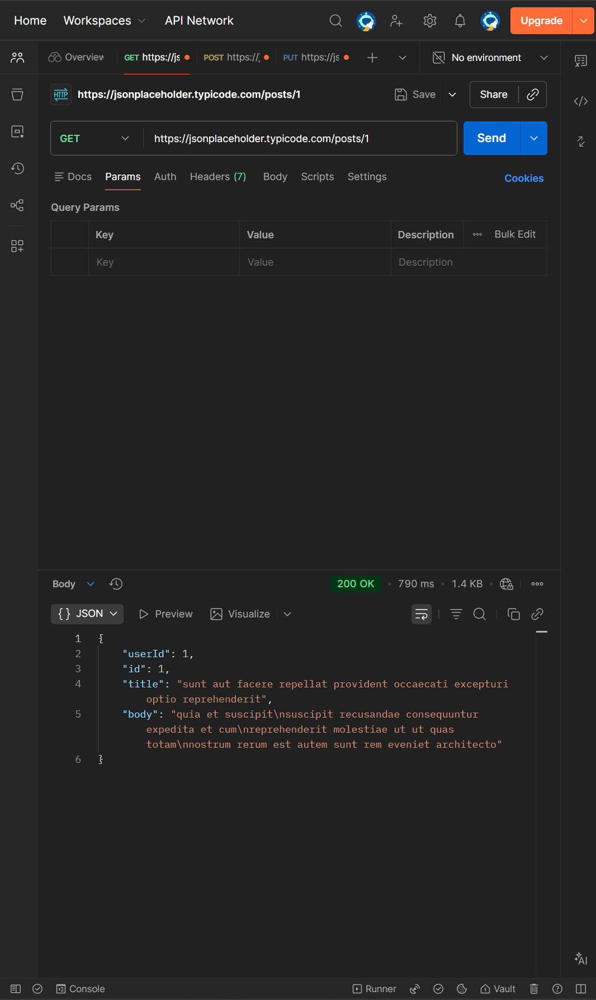
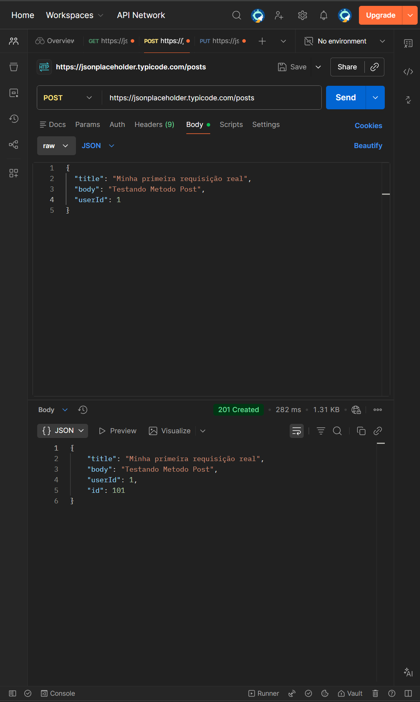
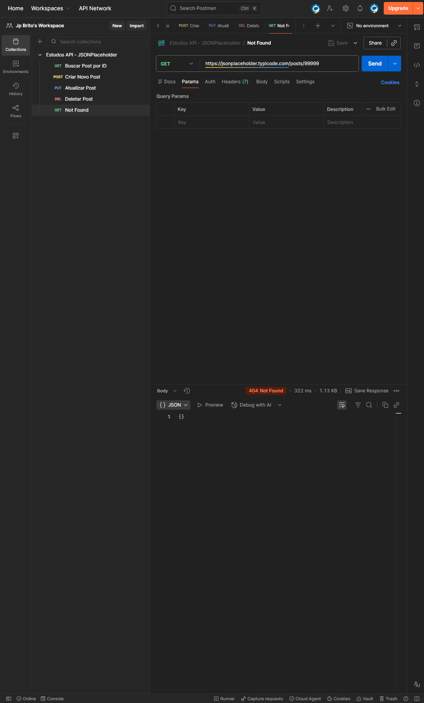

# Automação de Testes de API - JSONPlaceholder

Repositório destinado ao estudo de testes automatizados de API utilizando a ferramenta Postman. O projeto simula cenários reais de testes de regressão e performance em uma API REST.

## Tecnologias e Conceitos Aplicados
* **Postman**: Ferramenta principal para execução e automação dos testes.
* **JavaScript**: Scripts avançados para validação de regras de negócio e asserções.
* **Variáveis de Ambiente (Environments)**: Configuração de `base_url` para tornar a collection dinâmica e escalável entre diferentes ambientes (Dev/Prod).
* **Testes de Performance**: Validação de tempo de resposta (SLA) para garantir a eficiência da API.

---

## Cenários de Teste

Os scripts foram desenvolvidos na aba **Post-response** e cobrem:

1.  **Validação de Status Code**: Garante que a API retorna o código esperado (ex: 200 OK, 201 Created, 404 Not Found).
2.  **Validação de Contrato e Tipagem**: Verifica se o corpo da resposta (JSON) contém os campos e valores corretos.
3.  **Monitoramento de SLA**: Testes automatizados que falham se a resposta ultrapassar 200ms.
4.  **Cenários Negativos**: Testes propositais para garantir que a API trata erros de recursos inexistentes corretamente.
### Testes Negativos (Negative Testing)
Diferente dos testes de "caminho feliz", os testes negativos verificam como a API se comporta ao receber dados inválidos. Neste projeto, validei se a API retorna corretamente o **Status Code 404** ao buscar um recurso inexistente, garantindo que o sistema não exponha erros internos e responda de forma segura.

---

  
📸 Clique aqui para ver as evidências dos testes (Screenshots)

  
  ### Teste de Busca (GET)
  
  
  ### Teste de Criação (POST)
  
  
  ### Teste de Erro (404)
  

## Como Executar o Projeto

1.  **Baixe a Collection**: [ Clique aqui para baixar a Collection](./estudos-postman-api.json)
2.  **Importe no Postman**: No Postman, clique em `Import` e selecione o arquivo baixado.
3.  **Configure o Ambiente**:
   * Importe o arquivo [Produção.postman_environment.json](./Produção.postman_environment.json) no Postman.
   * No seletor de ambientes (canto superior direito), mude de `No Environment` para `Produção`.
4.  **Execute**: Abra a requisição e clique em `Send`. Os resultados aparecerão na aba `Test Results`.

---
*Este projeto demonstra minha evolução em QA, unindo testes manuais, automação e documentação técnica.*
